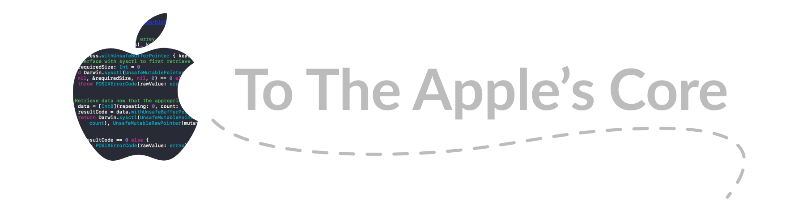

> *To The Apple's Core* serves as a house for testing the boundaries of what can be done on Native iOS without a jailbreak.
>
> This project is for educational purposes and the code should not be used in any application targeted for the App Store.

All projects and snippits are made for and run on **non-jailbroken** devices. While untested, most following snippits should be able to run in Playgrounds on iPad.

## Contents
- [:battery: Retrieve Device Battery Info](#battery-retrieve-device-battery-info)
- [:vibration_mode: Retreive App Info from SpringBoard](#retreive-app-info-from-springboard)
- [:airplane: Check for Airplane Mode](#airplane-check-for-airplane-mode)
- [:link: Gather Hotspot Info](#link-gather-hotspot-info)
- [:signal_strength: Obtain Networking Info (Wifi, Tethering, Etc.)](#signal_strength-obtain-networking-info-wifi-tethering-etc)
- [:iphone: Setting Lock Screen and Home Screen Images](#iphone-setting-lock-screen-and-home-screen-images)
---

## :battery: Retrieve Device Battery Info
```Swift
import Darwin
import Foundation

/**
 Obtains an array of dictionaries representing device battery info. Returns nil if there was an issue retrieving info from battery API.
 */
func deviceBatteryInfo() -> [[String: AnyObject]]? {
    guard case let handle = dlopen("/System/Library/PrivateFrameworks/BatteryCenter.framework/BatteryCenter", RTLD_LAZY), handle != nil,
        let c = NSClassFromString("BCBatteryDeviceController") as AnyObject as? NSObjectProtocol else {
            return nil
    }
    
    func sharedInstance() -> String { return "sharedInstance" } // Silence compiler warnings
    guard c.responds(to: Selector(sharedInstance())) == true else { return nil }
    
    let instance = c.perform(Selector(sharedInstance())).takeUnretainedValue()
    
    guard let batteries = instance.value(forKey: "connectedDevices") as? [AnyObject] else { return nil }
    
    let batteryInfo = batteries.compactMap { battery -> [String: AnyObject]? in
        var propertyCount: UInt32 = 0
        guard let properties = class_copyPropertyList(battery.classForCoder, &propertyCount) else { return nil }
        var batteryDictionary = [String: AnyObject]()
        
        for i in 0..<propertyCount {
            let cPropertyName = property_getName(properties[Int(i)])
            
            let pName = String(cString: cPropertyName)
            batteryDictionary[pName] = battery.value(forKey: pName) as AnyObject
        }
        
        free(properties) //release Obj-C property structs
        return batteryDictionary
    }
    
    return batteryInfo
}

print("Batteries' Info: \(deviceBatteryInfo())")
```

## Retreive App Info from SpringBoard


I've created an entire project around this idea called [AppExplorer](https://github.com/joncardasis/AppExplorer). Check out the repo for more info and how you can implement it in your own project.


## :airplane: Check for Airplane Mode
##### AirplaneManager.swift
```Swift
class AirplaneManager{
    
    /**
     Whether or not airplane mode is enabled. Returns nil if an error occured getting info from API.
     */
    static func isAirplaneModeEnabled() -> Bool?{
        guard case let handle = dlopen("/System/Library/PrivateFrameworks/AppSupport.framework/AppSupport", RTLD_LAZY), handle != nil,
            let c = NSClassFromString("RadiosPreferences") as? NSObject.Type else {
                return nil
        }
        let radioPreferences = c.init()
        
        if radioPreferences.responds(to: NSSelectorFromString("airplaneMode")) {
            return (radioPreferences.value(forKey: "airplaneMode") as AnyObject).boolValue
        }
        return false
    }
}

print("Airplane Mode Enabled: \(AirplaneManager.isAirplaneModeEnabled())")
```


## :link: Gather Hotspot Info
##### MobileHotspotReader.swift
### Setup
In order to use the SCDynamicStoreCreate and SCDynamicStoreCopyValue functions
the `__OSX_AVAILABLE_STARTING` macro will need to be changed for these functions.

The easiest way to do this is `⌘ + ⌥ + CLICK` on the function names in Xcode which will
take you to the respective headers. Comment out the macros as seen here:

```Objective-C
SCDynamicStoreRef __nullable SCDynamicStoreCreate (
			CFAllocatorRef __nullable allocator,
			CFStringRef name,
			SCDynamicStoreCallBack __nullable callout,
			SCDynamicStoreContext * __nullable context
			)	/*	__OSX_AVAILABLE_STARTING(__MAC_10_1,__IPHONE_NA)*/;
```

```Objective-C
CFPropertyListRef __nullable SCDynamicStoreCopyValue(
			SCDynamicStoreRef __nullable store,
			CFStringRef key
			)	/*	__OSX_AVAILABLE_STARTING(__MAC_10_1,__IPHONE_NA)*/;

```

### Example Usage
```Swift
let reader = MobileHotspotReader.sharedReader
print("Connected Devices: \(reader.numberOfConnectedDevices)")
print("Connected over Bluetooth: \(reader.connectionsOverBluetooth)")
```

## :signal_strength: Obtain Networking Info (Wifi, Tethering, Etc.)
##### NetworkManager.swift
This code requires **no** private apis, but does use hard-coded strings which may change in future OS versions.

### Example Usage:
```Swift
print("Wifi is Enabled     : \(NetworkManager.wifiEnabled())")
print("Wifi is Connected   : \(NetworkManager.wifiConnected())")
print("Currently Tethering : \(NetworkManager.isTethering())")
```

## :iphone: Setting Lock Screen and Home Screen Images
##### WallpaperSetter.playground

:warning: **DEPRECATED:** This snippits is deprecated due to iOS 11.0 preventing dynamic linking to the SpringBoardUI framework.

```Swift
import Darwin
import UIKit

struct WallpaperLocation: OptionSet {
    let rawValue: Int
    static let lockscreen = WallpaperLocation(rawValue: 1 << 0)
    static let homescreen = WallpaperLocation(rawValue: 1 << 1)
}

func setWallpaper(image: UIImage, location: WallpaperLocation) -> Bool{
    guard case let handle = dlopen("/System/Library/PrivateFrameworks/SpringBoardUI.framework/SpringBoardUI", RTLD_LAZY), handle != nil else{
        return false
    }
    guard case let symbol = dlsym(handle, "SBSUIWallpaperSetImageAsWallpaperForLocations"), symbol != nil else{
        return false
    }
    
    typealias methodSignature = @convention(c) (AnyObject, NSInteger) -> ()
    let _ = unsafeBitCast(symbol, to: methodSignature.self)(image, location.rawValue)
    dlclose(handle)
    return true
}

setWallpaper(image, location: [.homescreen, .lockscreen])
```